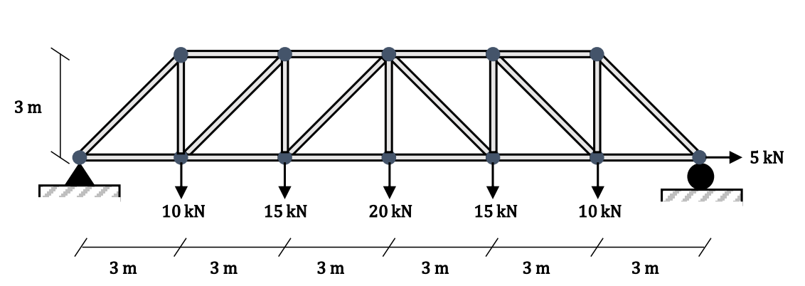

import CodeBlock from '@theme/CodeBlock';
import ej01_ArmaduraPlana from '!!raw-loader!./codigos/01_EjemploArmadura.py';

# Ejemplo de Armadura plana
En este ejercicio se va modelar la armadura que se muestra en la siguiente imagen:



## 1. Importación de Librerías:
```py
import openseespy.opensees as ops
import vfo.vfo as vfo
```
* `openseespy.opensees`: Es la librería principal de OpenSees para modelar y analizar estructuras.
* `vfo.vfo`: Se utiliza para visualizar el modelo estructural y la forma deformada tras el análisis.

## 2. Configuración del Modelo:
```py
ops.wipe()
ops.model('basic', '-ndm', 2, '-ndf', 2)
```
* `ops.wipe()` : Limpia cualquier modelo anterior en OpenSees.
* `ops.model('basic', '-ndm', 2, '-ndf', 2)`: Define un modelo básico en 2D, 
donde `-ndm 2` indica un modelo de 2 dimensiones y `-ndf 2` significa que cada nodo tiene 2 grados de libertad (desplazamientos en X e Y).

## 3. Definición de Nodos:
```py
ops.node(1, 0.0, 0.0)
ops.node(2, 3.0, 0.0)
...
```
* Cada línea `ops.node` define un nodo en el modelo. 
Los argumentos son: el ID del nodo y las coordenadas X e Y. Estos nodos representan las intersecciones de la armadura.

## 4. Apoyos o Restricciones:

```py
ops.fix(1, 1, 1)
ops.fix(7, 0, 1)
```
* `ops.fix(ID, Fx, Fy)` define las restricciones en los grados de libertad de los nodos.
    * En el nodo 1, ambas componentes (`Fx`, `Fy`) están restringidas.
    * En el nodo 7, solo el desplazamiento vertical está restringido (`Fy`), permitiendo movimiento en el eje X.

## 5. Definición del Material:
```py
tagMaterial = 1
ops.uniaxialMaterial('Elastic', tagMaterial, 200e9)
```
* Se crea un material elástico con un módulo de elasticidad de $200 \times 10^{9} \mathrm{~N/m^2}$ 
para ser utilizado en los elementos de la armadura.

:::info[]

Se pueden definir diferentes tipos de materiales de tipo `uniaxialMaterial()` 
para lo cual se pueden ingresar diferentes argumentos, para mas informacion, 
se debe consultar la [Documentacion de OpenSeesPy](https://openseespydoc.readthedocs.io/en/latest/src/uniaxialMaterial.html)

:::

:::info[]

Tambien se puede consultar la documentacion original de [OpenSees](https://opensees.berkeley.edu/wiki/index.php?title=UniaxialMaterial_Command)
aqui encontraremos mas informacion acerca de los parametros necesarios y graficas para entender mejor acerca de los parametros.

:::

## 6. Elementos de la Armadura:
```py
ops.element('truss', 1, 2, 1, 0.0005, tagMaterial)
...
```
* `ops.element('truss', id_elemento, nodo1, nodo2, area, material)` define los elementos de la armadura. 
`truss` es un tipo de elemento finito que solo transmite carga axial.
    * Cada elemento conecta dos nodos y tiene una sección transversal de área definida, así como el material previamente declarado.
    * Se definen tanto los tirantes inferiores como superiores con diferentes áreas.

## 7. TimeSeries y Patrones de Cargas
```py
timeLinear = 1
ops.timeSeries('Linear', timeLinear)
ops.pattern('Plain', 1, timeLinear)
```
* `ops.timeSeries('Linear', id_serieTiempo)`: La serie de tiempo define la forma en que se va aplicar la carga en el tiempo, 
o numero de pasos que se va usar para ir aplicando la carga. 
Las cargas se aplican de manera gradual para evitar inestabilidades numericas,
en este ejemplo no habria ningun problema en aplicar las cargas de golpe, pero se esta usando esta serie de tiempo `Linear`.
* `ops.pattern('Plain', 1, timeLinear)` Para cargas puntuales de fuerzas o momentos y para cargas distribuidas, se usa el patron `Plain`, 
para otro tipo de cargas por ejemplo sismicas se usan otro tipo de patron.

## 7. Aplicación de Cargas:
```py
ops.load(2, 0.0, -10000)
ops.load(7, 5000, 0.0)
```
* `ops.load(nodo, Fx, Fy)` aplica cargas en los nodos de la estructura (esto solo es posible si se definio el patron `Plain`). 
En este caso, hay fuerzas aplicadas en Y (fuerzas verticales) y una fuerza en X en el nodo 7.

## 8. Visualización Inicial del Modelo:
```py
vfo.createODB(model="Armadura",loadcase="Estatico")
vfo.plot_model(model="Armadura", show_nodes='yes', show_nodetags='yes', show_eletags='yes')
```
* `vfo.createODB` y `vfo.plot_model` crean un archivo para la base de datos y visualizan el modelo estructural, mostrando los nodos y los elementos.

## 9. Registros de Salida:
```py
ops.recorder('Element','-xml','Fuerzas.xml','-time','-ele',1,2,3,9,10,'basicForces')
ops.recorder('Node','-file','DeflexionSup.txt','-node',8,9,10,11,12,'-dof',2,'disp')
ops.recorder('Node','-file','DeflexionInf.txt','-node',1,2,3,4,5,6,7,'-dof',2,'disp')
```
* Los `recorder` almacenan resultados en archivos.
    * `basicForces` almacena las fuerzas en los elementos.
    * `2` es la direccion del grado de libertad.
    * `disp` guarda los desplazamientos de los nodos seleccionados, se podria usar aceleraciones `acel`.

## 10. Análisis Estático:
```py
ops.system('BandGeneral')
ops.numberer('RCM')
ops.constraints('Plain')
ops.test('NormDispIncr', 1.0e-6, 10)
ops.integrator('LoadControl', 0.1)
ops.algorithm('Newton')
ops.analysis('Static')
ops.analyze(10)
```
* `ops.system()` Define el sistema de ecuaciones, `'BandGeneral'` es el mas basico.
* `ops.numberer()` Relaciona las ecuaciones con los grados de libertad
* `ops.constraints()` Define como las restricciones son consideradas.

Estas tres primeras configuraciones, define como se maneja las ecuaciones, en modelos grandes si conviene definirlos
de forma que se seleccione un algoritmo adecuado, mas eficiente.

* `ops.test('NormDispIncr', 1.0e-6, 10)` Prueba de convergencia `'NormDispIncr'`, con una tolerancia de $1.0\times 10^{-6}$ 
y un maximo de $10$ iteracciones. 
Define cuando nuestro modelo ha convergido, se selecciona un algoritmo, 
ademas que hay que definir la tolerancia y el maximo numero de iteracciones para alcanzar la tolerancia.
En consecuencia esto afecta nuestros resultados y tiempo de ejecucion.
* `ops.integrator('LoadControl', 0.1)` Determina la respuesta en el siguiente paso del analisis, método de integración de las cargas. 
Recordemos que escogimos un timeSeries `Linear`
entonces con el valor de `0.1` se haran incrementos lineales de 0.1, Ojo que para llegar al 100% de la carga tendrian que aplicarse 10 pasos, 
esto se define en `ops.analyze(10)`.
* `ops.algorithm('Newton')` Algoritmo para resolver el sistema de ecuaciones.
* `ops.analysis('Static')` Crea el objeto analisis, para Dinamico seria `'Transient'`.
* `ops.analyze(10)` Ejecuta el analisis en 10 pasos de carga, debe ser consitente con `ops.integrator('LoadControl', 0.1)` (el 0.1).


## 11. Visualización de Resultados:
```py
vfo.plot_deformedshape(model="Armadura", loadcase="Estatico", scale=20)
```
* Muestra la forma deformada del modelo estructural tras el análisis.


<details>
  <summary>**Codigo en Python**</summary>

  En este ejemplo vemso como ponemos usar la clase UnitUtils (Disponible para Revit 2022 o superior). para convertir unidades del sistema Interno a una undiad en especifico
  <CodeBlock language="py">{ej01_ArmaduraPlana}</CodeBlock>
  {/* <CodeBlock language="py">{ej_cotasLinea}</CodeBlock> */}
</details>

